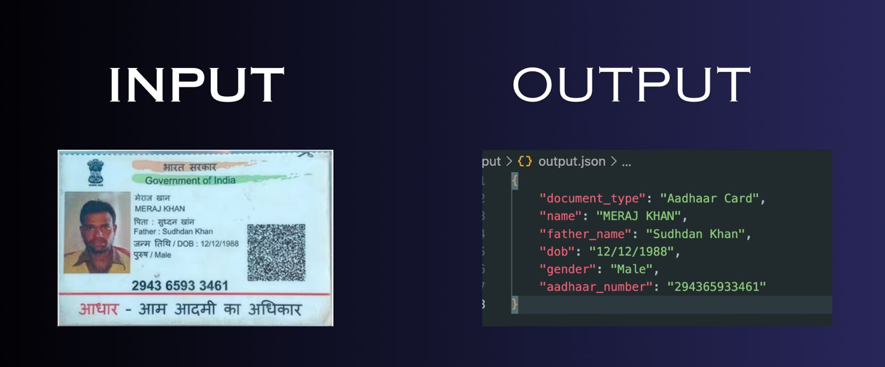

# 🔍 Systemize Data Using OCR



> A robust OCR pipeline for extracting structured data from Aadhaar card images with intelligent preprocessing and JSON output.

---

## 📋 Quick Links

- **Code:** `main.py`
- **Dependencies:** `requirements.txt`
- **Sample data:** `data/`
- **Output:** `output/` (contains `output.json`, `raw.txt` and debug images)

---

## ✨ Features

- **Multi-format Support** - Handles RGB and RGBA images seamlessly
- **Adaptive Preprocessing** - Otsu and adaptive thresholding for optimal text recognition
- **Smart Resizing** - Preserves aspect ratio for better OCR accuracy
- **Debug Output** - Saves preprocessed images for inspection
- **Structured Export** - Outputs clean JSON with extracted fields

---

## 🔧 Requirements

**System:**
- Python 3.10+
- Tesseract OCR engine

**Tesseract Installation:**

*macOS:*
```bash
brew install tesseract
```

*Linux (Ubuntu):*
```bash
sudo apt update
sudo apt install -y tesseract-ocr libtesseract-dev
```

*Windows:* Download the installer from the [Tesseract project](https://github.com/tesseract-ocr/tesseract) and add to PATH.

**Python Packages:**
```bash
python3 -m venv .venv
source .venv/bin/activate
pip install -r requirements.txt
```

Core dependencies:
```
pytesseract
opencv-python
pillow
```

---

## 🚀 Installation & Usage

1. **Clone** the repository
2. **Install** Tesseract (see above)
3. **Set up** virtual environment
4. **Install** Python packages: `pip install -r requirements.txt`
5. **Add** images to `data/` folder (e.g., `data/aadhar.png`)
6. **Run:**

```bash
python3 main.py
```

**Output:**
- `output/raw.txt` - Raw OCR text
- `output/output.json` - Structured extracted data

---

## 🔄 Pipeline Overview

### 1. Image Loading
Load Aadhaar card image using OpenCV.

### 2. First Pass Preprocessing
- Convert to grayscale for simplified processing
- Resize to enhance text visibility
- Apply blur to reduce noise
- Extract text using Tesseract (English + Hindi)

### 3. Second Pass (Name Extraction)
- Apply advanced thresholding for better text contrast
- Re-run OCR specifically for name field
- Improves accuracy for critical information

### 4. Raw Text Storage
Save unprocessed OCR output to `raw.txt` for verification.

### 5. Information Extraction
Extract key fields using pattern matching:
- **Name** - Uppercase text near card top
- **Father's Name** - Text following "Father" keyword
- **Date of Birth** - DD/MM/YYYY format
- **Gender** - Male/Female identification
- **Aadhaar Number** - 12-digit sequence (with or without spaces)

### 6. JSON Conversion & Export
Organize extracted data into structured JSON format and save to `output/output.json`.

---

## 🤖 Future Enhancements with NLP/LLM

### 1. Automatic Error Correction
Fix OCR misreadings intelligently using language models.

### 2. Context-Aware Extraction
Use LLMs to understand card layout variations and extract information even when formatting differs.

### 3. Smart Validation
Verify DOB plausibility and Aadhaar number validity automatically.

### 4. Enhanced Multilingual Support
Better handling of mixed-language text and regional variations.

---

## ⚠️ Assumptions

1. **Clear Image Input** - High-quality, unblurred images
2. **Standard Layout** - Typical Aadhaar card format
3. **Language Support** - English or Hindi text
4. **Readable Text** - Adequate font size and contrast
5. **Single Card** - One Aadhaar card per image
6. **Valid Format** - 12-digit Aadhaar number (may include spaces)
7. **No Modifications** - No handwritten edits on the card

---

## 🤝 Contributing

Contributions are welcome! Please:
1. Fork the repository
2. Create a feature branch
3. Add tests or sample images demonstrating your changes
4. Open a pull request

---

*Built with ❤️ for streamlined identity document processing*